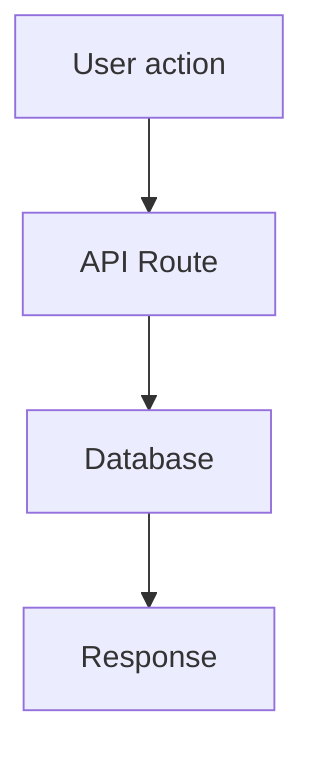

# PLAN.md — Current Build Plan

Written by Claude before any task touching 3+ files.
Developer approves before Claude proceeds. Plans are never deleted — they become history.

---

## When a Plan Is Required

A plan is required when a change is **risky**, not just when it's large.
A 3-file change to auth is riskier than a 20-file mechanical rename.

**Always requires a plan:**
- Touches auth, payments, or session logic
- Changes database schema or migrations
- Changes a public API contract (adds, removes, or renames endpoints/fields)
- Affects more than one domain simultaneously (e.g. UI + API + DB together)
- Introduces a new third-party service or integration
- Involves more than 10 files of non-mechanical changes

**Never requires a plan (fast track):**
- Mechanical refactor (rename, move files, no logic change)
- Test-only additions
- Documentation updates in `docs/`
- Dependency updates (`package.json` + lock file)
- Copy or content changes (no logic)
- Bug fixes touching ≤ 5 files with no schema changes

Developer can also say **"fast track"**, **"approved"**, or **"LGTM"** to skip the plan
for anything borderline.

Even on fast track: still stage and describe changes before committing. Still update
`ENV.md` if vars change. Still append to `DECISIONS.md` if a tool choice is made.

---

## Status: [ DRAFT | APPROVED | IN PROGRESS | COMPLETE ]

---

## Plan: [Feature or Task Name]

**Date:** YYYY-MM-DD
**Complexity:** [Low | Medium | High]
**Requested by:** [brief description of the original ask]
**Estimated scope:** [~N files changed, ~N new files]

---

## Summary

What this does and why it's needed. 2–4 sentences max.

---

## Files to be Modified

| File | What changes |
|---|---|
| `src/components/X.tsx` | Add loading state prop |
| `src/lib/api.ts` | Add retry logic |

## Files to be Created

| File | Purpose |
|---|---|
| `src/hooks/useRetry.ts` | New hook for retry logic |
| `src/components/X.test.tsx` | Tests for new behaviour |

---

## Implementation Steps

1. Step one — what and why in this order
2. Step two
3. Write tests
4. Update `docs/ENV.md` if new vars introduced
5. Update `docs/DECISIONS.md` if a tool or pattern choice is made

---

## Architecture Diagram (if applicable)

---

## Edge Cases & Risks

- What could go wrong?
- What are the failure modes?
- Rollback plan?

---

## Out of Scope

What this plan explicitly does not cover.

---

## Dependencies

- New packages needed? (check bundlephobia first)
- New env vars? (will be added to ENV.md)
- Database migration required?

---

## Definition of Done

- [ ] All steps complete
- [ ] Tests written and passing
- [ ] `npm run typecheck` — zero errors
- [ ] `npm run lint` — zero errors
- [ ] `docs/ENV.md` updated if vars changed
- [ ] `docs/DECISIONS.md` updated if choices made
- [ ] Plan status → COMPLETE

---

<!-- Previous completed plans are preserved below this line -->
